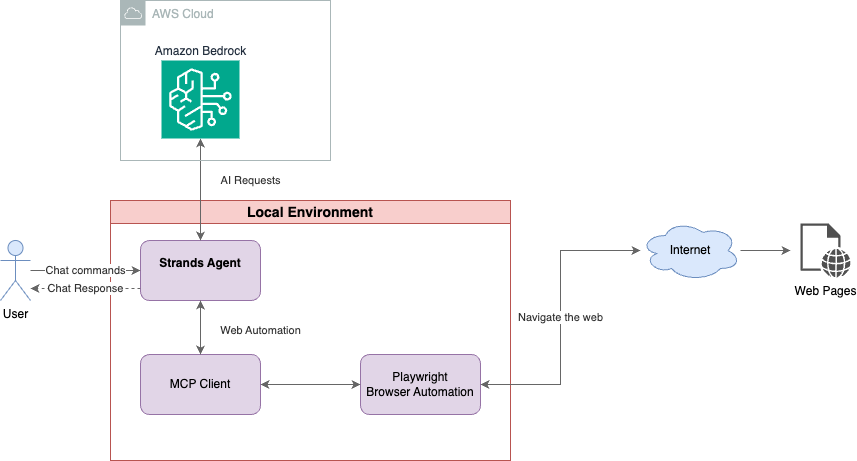

# Web Automation Agent

A web automation agent built with the Strands Agents SDK and Playwright MCP (Model Context Protocol) that can browse the web, interact with websites, and perform complex web automation tasks through natural language conversations.

## 🏗️ Architecture



The agent runs locally and integrates with Amazon Bedrock for AI capabilities while using Playwright for web automation through the MCP (Model Context Protocol).

## 🚀 Features

- **Natural Language Web Automation**: Control web browsers through conversational AI
- **Comprehensive Web Interactions**: Navigate, click, fill forms, extract data, and take screenshots
- **Playwright Integration**: Leverages Playwright's robust web automation capabilities via MCP
- **Multi-tool Support**: Includes time utilities and calculator functions
- **Interactive Chat Interface**: Conversational interface for easy interaction
- **Headless Browser Support**: Runs efficiently in headless mode for automation tasks

## 🛠️ Technologies Used

- **[Strands Agents SDK](https://github.com/strands-ai/strands-agents)**: Core AI agent framework
- **[Playwright MCP](https://github.com/microsoft/playwright)**: Web automation via Model Context Protocol
- **[MCP (Model Context Protocol)](https://github.com/modelcontextprotocol/python-sdk)**: Standardized AI-tool communication
- **Python 3.13+**: Modern Python runtime
- **Node.js**: Required for Playwright browser automation

## 📋 Prerequisites

- Python 3.13 or higher
- Node.js and npm
- macOS, Linux, or Windows

## 🔧 Installation

1. **Clone or navigate to the project directory:**
   ```bash
   cd /path/to/web_automation_agent
   ```

2. **Create and activate a Python virtual environment:**
   ```bash
   python3 -m venv venv
   source venv/bin/activate  # On Windows: venv\Scripts\activate
   ```

3. **Install Python dependencies:**
   ```bash
   pip install -r requirements.txt
   ```

4. **Install Node.js dependencies:**
   ```bash
   npm install
   ```

5. **Install Playwright browsers:**
   ```bash
   npx playwright install
   ```

## 🚀 Usage

### Running the Web Automation Agent

1. **Activate the virtual environment:**
   ```bash
   source venv/bin/activate
   ```

2. **Start the agent:**
   
   **Default (Headless mode):**
   ```bash
   python web_automation_agent.py
   ```
   
   **Visible browser mode:**
   ```bash
   python web_automation_agent.py --visible
   ```
   
   The agent runs in headless mode by default for efficient automation. Use the `--visible` flag when you want to see the browser interactions in real-time.

### Special Commands

During runtime, you can use these special commands:

- **`aws-check`** - Check current AWS credentials status
- **`aws-update`** - Update AWS credentials without restarting the agent
- **`quit`** or **`exit`** - Exit the agent

### Example Interactions

- **"Visit google.com and tell me what you see"**
- **"Search for 'Python web scraping' on Google"**
- **"Go to example.com and take a screenshot"**
- **"Fill out the contact form on [website] with test data"**
- **"Extract all the links from the current page"**
- **"What time is it?"**
- **"Calculate 15 * 24"**

## 🧪 Testing

Test the Playwright MCP connection:

```bash
python test_playwright_mcp.py
```

This will verify that:
- Playwright MCP server can be started
- Connection is established successfully
- Available tools are listed correctly

## 📁 Project Structure

```
web_automation_agent/
├── web_automation_agent.py    # Main agent application
├── test_playwright_mcp.py     # MCP connection test script
├── requirements.txt           # Python dependencies
├── package.json              # Node.js dependencies
├── package-lock.json         # Node.js lock file
├── venv/                     # Python virtual environment
├── node_modules/             # Node.js modules
├── test-results/             # Playwright test results
└── README.md                 # This file
```

## 🔧 Configuration

### Browser Display Mode

The agent supports two browser modes:

- **Headless Mode (Default)**: Browser runs invisibly in the background for efficient automation
- **Visible Mode**: Browser window is displayed so you can watch the automation in real-time

Use the `--visible` flag to run in visible mode:
```bash
python web_automation_agent.py --visible
```

### Model Configuration

The agent uses Claude 3.7 Sonnet by default. You can modify the model in `web_automation_agent.py`:

```python
agent = Agent(
    model="us.anthropic.claude-3-7-sonnet-20250219-v1:0",  # Change this line
    tools=all_tools,
    system_prompt="""..."""
)
```

### Playwright Configuration

The agent runs Playwright in headless mode by default for efficient automation. To run with a visible browser, use the `--visible` command-line flag:

```bash
python web_automation_agent.py --visible
```

The MCP client automatically configures the appropriate browser mode based on your command-line arguments.

## 🎯 Web Automation Capabilities

The agent can perform various web automation tasks:

### Navigation
- Visit websites by URL
- Navigate forward/backward in browser history
- Refresh pages
- Handle multiple tabs and windows

### Interaction
- Click buttons, links, and interactive elements
- Fill out forms and input fields
- Submit forms
- Handle dropdowns and select elements
- Upload files

### Data Extraction
- Extract text content from pages
- Get page titles and metadata
- Capture element attributes
- Extract structured data from tables

### Visual Operations
- Take screenshots of pages or specific elements
- Wait for elements to appear/disappear
- Handle dynamic content loading

### Advanced Features
- Handle JavaScript-heavy applications
- Work with iframes
- Manage cookies and sessions
- Handle authentication flows

## 🛠️ Dependencies

### Python Dependencies
- `strands-agents>=0.1.0` - Core agent framework
- `strands-agents-tools>=0.1.0` - Additional agent tools
- `mcp>=1.0.0` - Model Context Protocol implementation
- Plus various supporting libraries (boto3, pydantic, httpx, etc.)

### Node.js Dependencies
- `@playwright/test^1.53.1` - Playwright testing framework
- Playwright browsers (Chromium, Firefox, WebKit)

---

**Happy Web Automating! 🤖🌐**

If you find this project helpful, feel free to send a thank you to @grazzini!
